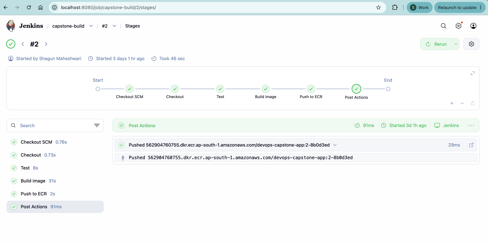
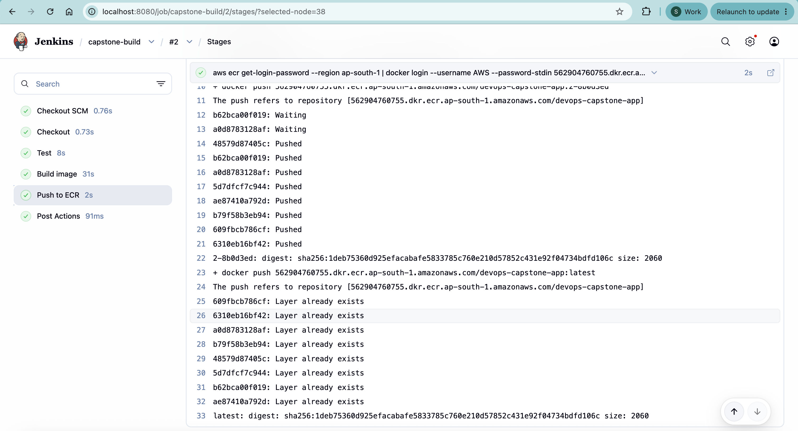
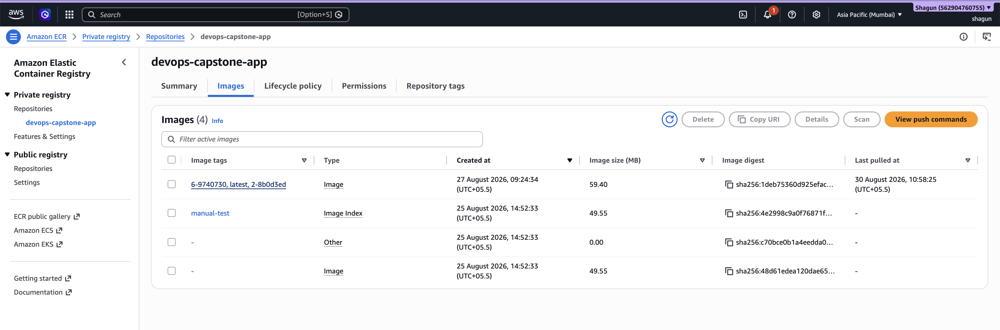
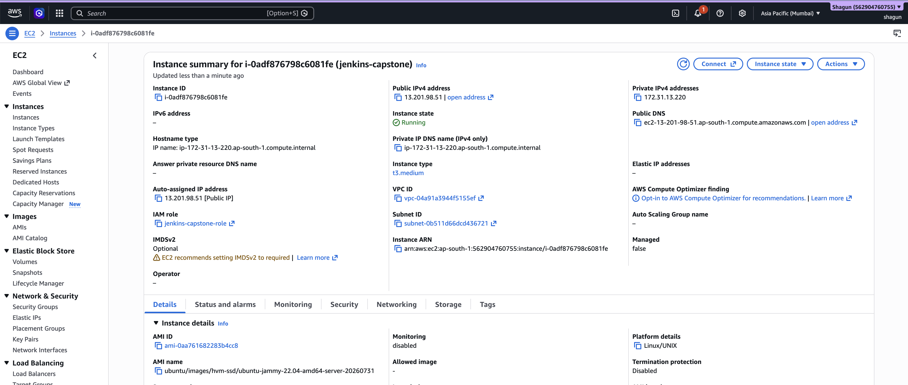
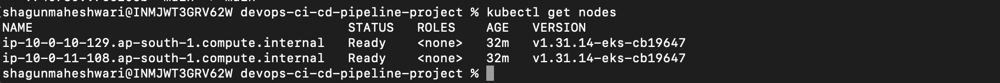
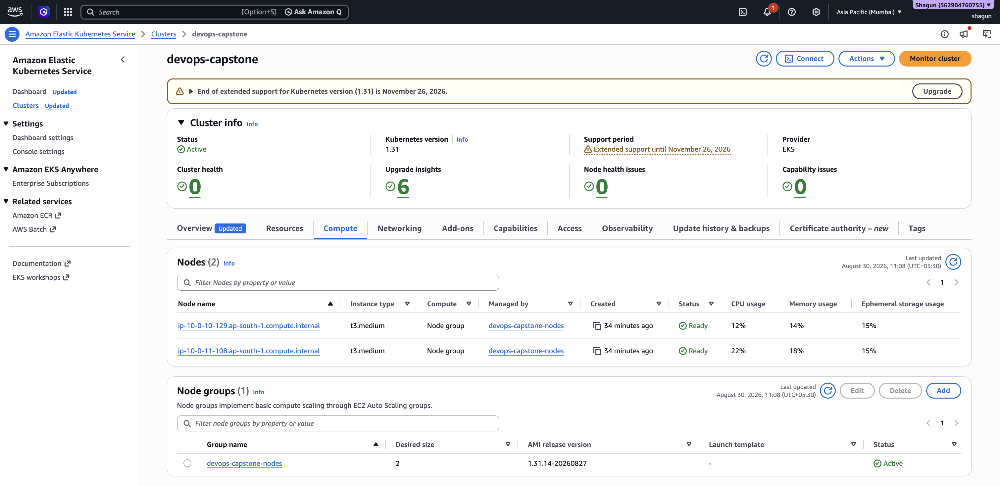
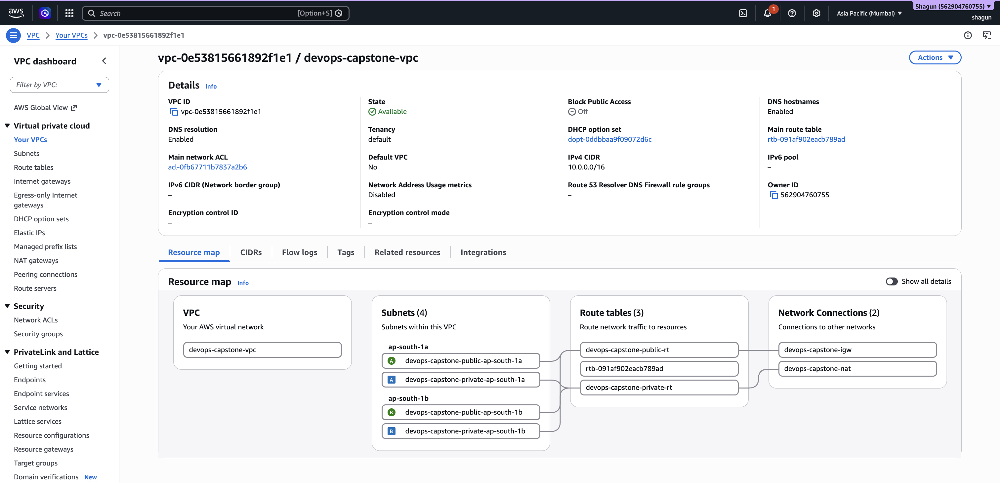
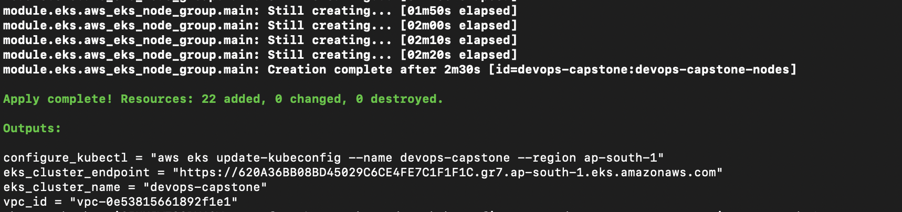
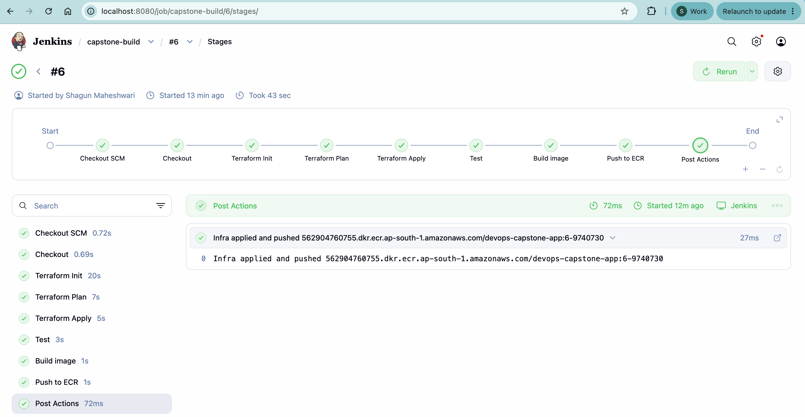

# End-to-End DevOps CI/CD Capstone

A hands-on capstone building a complete CI/CD pipeline on AWS: containerized app →
Jenkins → Terraform-provisioned EKS → Kubernetes deployment → Prometheus/Grafana
monitoring, all driven from a single Jenkins pipeline.

**Status:** Sprint 3 in progress (Ansible playbooks added; pending Jenkins pipeline verification). See [Progress](#progress) below.

## Architecture

```
Developer --push--> GitHub --webhook/poll--> Jenkins (EC2)
                                                 |
                          -----------------------+-----------------------
                          |            |            |            |
                     Docker build   Terraform    Ansible      kubectl
                          |          (VPC/EKS/     (host       apply
                          v           IAM/S3)      config)        |
                        ECR                                       v
                          |                                 EKS Cluster
                          +------------------image pull---------->|
                                                                   |
                                                        App Deployment + Service
                                                        HPA (CPU-based, 2-5 pods)
                                                        Prometheus + Grafana
```

Full details in [docs/architecture.md](docs/architecture.md).

## Tech stack

| Layer | Tool |
|---|---|
| App | Python (Flask) |
| Containerization | Docker (multi-stage build) |
| CI/CD | Jenkins (self-hosted on EC2) |
| Image registry | Amazon ECR |
| Infrastructure as Code | Terraform |
| Compute | Amazon EKS (Kubernetes) |
| Config management | Ansible *(Sprint 3)* |
| Monitoring | Prometheus + Grafana *(Sprint 5)* |
| Cloud | AWS (`ap-south-1`) |

## Repository layout

```
app/          # Flask app, Dockerfile, tests
terraform/    # VPC, EKS, IAM, remote state backend
ansible/      # Host configuration playbooks (Sprint 3)
jenkins/      # Jenkinsfile
kubernetes/   # Deployment manifests (Sprint 4)
monitoring/   # Prometheus/Grafana manifests (Sprint 5)
docs/         # Architecture, sprint logs, screenshots
```

## Progress

### ✅ Sprint 1 — Docker, ECR, Jenkins foundation

Containerized the app, set up Jenkins on EC2 with an IAM instance profile (no
stored AWS credentials), and got a pipeline building and pushing to ECR on every
commit.

| | |
|---|---|
| Jenkins dashboard |  |
| Successful pipeline run |  |
| ECR repository with pushed images |  |
| Jenkins EC2 instance |  |

Full log: [docs/sprint-1.md](docs/sprint-1.md)

### ✅ Sprint 2 — Terraform infrastructure + Jenkins integration

Provisioned a VPC and EKS cluster entirely through Terraform, with remote state in
S3 + DynamoDB, then wired `terraform init/plan/apply` into the Jenkins pipeline
itself — so infrastructure changes are driven by the same pipeline as app changes.

| | |
|---|---|
| `kubectl get nodes` — healthy cluster |  |
| EKS cluster (AWS Console) |  |
| VPC (AWS Console) |  |
| `terraform apply` — 22 resources created |  |
| Jenkins pipeline with Terraform stages |  |

Full log: [docs/terraform.md](docs/terraform.md)

### 🔄 Sprint 3 — Ansible configuration management

Ansible playbooks configure the Jenkins EC2 host (Docker, kubectl, kubeconfig) and run automatically after the Terraform stages in the pipeline.

Full log: [docs/ansible.md](docs/ansible.md)

### 🔲 Sprint 4 — CI/CD deploy to EKS
### 🔲 Sprint 5 — Prometheus, Grafana, alerting
### 🔲 Sprint 6 — Testing, documentation, production readiness

## Quickstart — running the app locally

```bash
cd app
docker build -t app:local .
docker run -p 8080:8080 app:local
curl http://localhost:8080/health
```

## Quickstart — infrastructure

```bash
cd terraform
terraform init
terraform plan
terraform apply
```

See [docs/terraform.md](docs/terraform.md) for variables, backend setup, and
cost/destroy notes — the EKS cluster bills continuously while running, so it's
recommended to `terraform destroy` between work sessions during development.

## Cost notes

This project is optimized for a dev/demo budget, not production scale — single
NAT gateway, small node instance types, and a destroy-between-sessions workflow
for the EKS cluster. See the cost breakdown in
[docs/terraform.md](docs/terraform.md#estimated-monthly-cost-if-left-running-continuously).

## Notable engineering decisions and lessons learned

A few real infrastructure problems came up during this build that are worth
calling out (full details in each sprint's log):

- **IAM instance profiles over static credentials** — Jenkins never stores AWS
  access keys; it inherits permissions entirely through the EC2 instance profile.
- **Corporate network constraints** — direct SSH and HTTP to the Jenkins EC2
  instance were blocked by a corporate proxy (Zscaler) doing deep packet
  inspection. Worked around using AWS Systems Manager Session Manager (HTTPS-based
  shell access) and SSM port forwarding, instead of opening the network up further.
- **Caller permissions vs. service-role permissions** — discovered that
  `AmazonEKSClusterPolicy`/`AmazonEKSServicePolicy` govern what the *cluster's own
  role* can do, not what a caller (like Jenkins/Terraform) needs to manage the
  cluster via the API — these are easy to conflate and the AWS documentation
  doesn't make the distinction obvious.

See [docs/sprint-1.md](docs/sprint-1.md) and [docs/terraform.md](docs/terraform.md)
for the complete troubleshooting notes.

