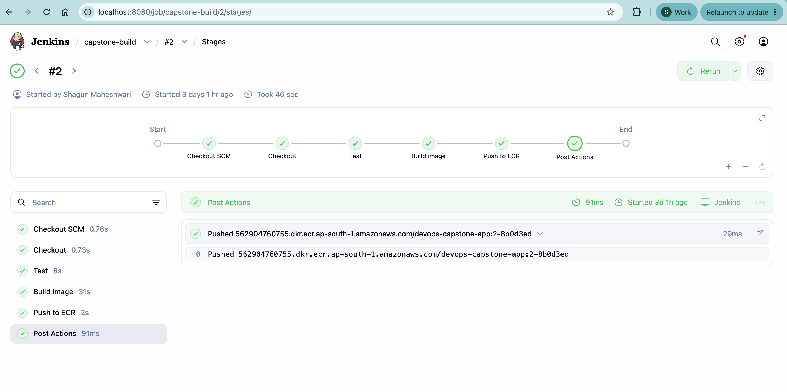
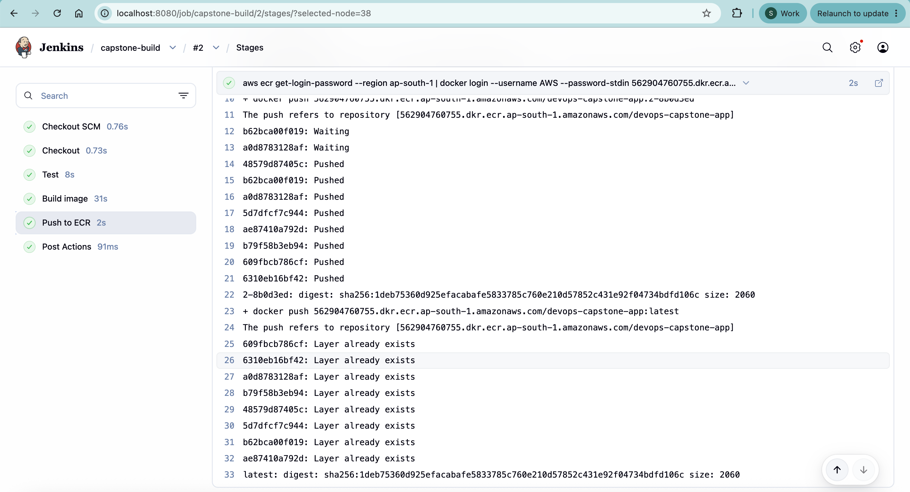
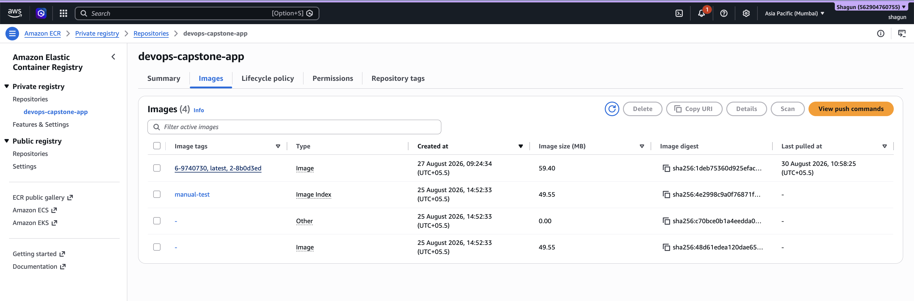
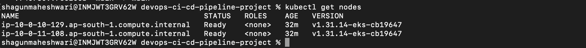
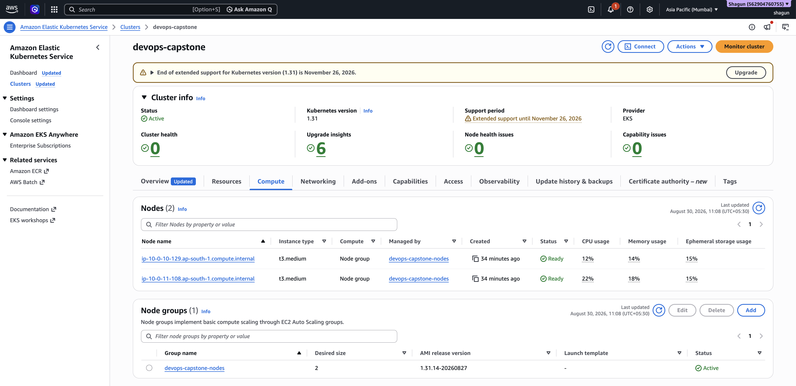

# Project 4 — End-to-End DevOps CI/CD Capstone

Automated pipeline for a Dockerized web app on **AWS EKS**, orchestrated by **Jenkins**: infrastructure (Terraform), configuration (Ansible), deployment (Kubernetes), and observability (Prometheus/Grafana).

| Evaluation (per [docs/task.md](docs/task.md)) | Weight |
|-----------------------------------------------|--------|
| Implementation | 75% |
| Documentation | 15% |
| Cost optimization | 10% |

**Region:** `ap-south-1` · **Requirements source:** [docs/task.md](docs/task.md)

---

## Status and open PR stack

Sprints **1–4** are on `main`. Sprints **5–6** and final polish are in stacked PRs — merge **in order**:

| Step | PR | Branch → base | Scope |
|------|-----|---------------|--------|
| 1 | [#3](https://github.com/shinmaheshwari/devops-ci-cd-pipeline-project/pull/3) | `feat/sprint-5-monitoring` → `main` | Sprint 5 — monitoring |
| 2 | [#4](https://github.com/shinmaheshwari/devops-ci-cd-pipeline-project/pull/4) | `feat/sprint-6-finalization` → `#3` branch | Sprint 6 — docs & validation |
| 3 | [#7](https://github.com/shinmaheshwari/devops-ci-cd-pipeline-project/pull/7) | `feat/capstone-review-fixes` → `#4` branch | Review-gap fixes |
| 4 | **Latest** | `feat/readme-finalization` → `#7` branch | README & submission guide |

After each merge, retarget the next PR to `main` if GitHub still shows an old base.

---

## Project goals (task mapping)

| Goal | How this repo delivers it | Primary doc |
|------|---------------------------|-------------|
| Architecture (LB, orchestration, monitoring) | VPC, EKS, LB Service, Prometheus/Grafana | [docs/architecture.md](docs/architecture.md) |
| Terraform (VPC, subnets, EKS, S3 state) | `terraform/` + Jenkins Terraform stages | [docs/terraform.md](docs/terraform.md) |
| Ansible configuration | `ansible/` after Terraform in pipeline | [docs/ansible.md](docs/ansible.md) |
| App on EKS (scale, resilience) | `kubernetes/` + HPA + probes | [docs/kubernetes.md](docs/kubernetes.md) |
| Jenkins CI/CD | `jenkins/Jenkinsfile` | [docs/pipeline.md](docs/pipeline.md) |
| Prometheus & Grafana | `monitoring/` | [docs/monitoring.md](docs/monitoring.md) |

---

## Capstone pipeline stages → Jenkins

Single declarative pipeline: [jenkins/Jenkinsfile](jenkins/Jenkinsfile).

| Capstone stage ([task.md](docs/task.md)) | Jenkins stages |
|------------------------------------------|----------------|
| **1. Build** | Test → Build image → Push to ECR |
| **2. Infrastructure** | Terraform Init → Plan → Apply (`terraform validate` on init) |
| **3. Configuration** | Ansible Configure |
| **4. Deployment** | Deploy → Post-deploy smoke test |
| **5. Test & monitor** | Monitoring → Pipeline validation |

**Triggers:** Git push / SCM poll (`H/15 * * * *`) — see [docs/jenkins-triggers.md](docs/jenkins-triggers.md).

```
Checkout → Terraform → Ansible → Test → Build → ECR → Deploy → Smoke → Monitoring → Validation
```

---

## Repository layout

```
app/           # Flask app, Dockerfile, pytest
terraform/     # VPC, EKS, S3 backend, IAM
ansible/       # Playbooks (Jenkins host)
jenkins/       # Jenkinsfile
kubernetes/    # Deployment, Service, HPA
monitoring/    # Prometheus, Grafana, kube-state-metrics, node-exporter
docs/          # Runbooks, sprint logs, task.md
```

---

## Sprint progress

| Sprint | Topic | Status on `main` | Log |
|--------|--------|------------------|-----|
| 1 | Docker, ECR, Jenkins | ✅ Merged | [docs/sprint-1.md](docs/sprint-1.md) |
| 2 | Terraform + Jenkins | ✅ Merged | [docs/terraform.md](docs/terraform.md) |
| 3 | Ansible | ✅ Merged | [docs/ansible.md](docs/ansible.md) |
| 4 | Deploy to EKS | ✅ Merged | [docs/pipeline.md](docs/pipeline.md) |
| 5 | Prometheus, Grafana | 🔄 PR #3 | [docs/monitoring.md](docs/monitoring.md) |
| 6 | E2E docs, automation | 🔄 PR #4 | [docs/sprint-6.md](docs/sprint-6.md) |

Screenshots for submission: [docs/screenshots/README.md](docs/screenshots/README.md) (add PNGs so tables below render on GitHub).

<details>
<summary>Sprint 1–2 screenshot placeholders</summary>

| Sprint 1 | |
|----------|---|
| Jenkins dashboard |  |
| Pipeline console |  |
| ECR |  |

| Sprint 2 | |
|----------|---|
| kubectl nodes |  |
| EKS console |  |

</details>

---

## Step-by-step — run the full capstone

### Prerequisites

- AWS account with permissions for EKS, ECR, VPC, S3, DynamoDB
- Jenkins on EC2 (see [docs/sprint-1.md](docs/sprint-1.md)) with **Pipeline from SCM**
- Job **Script Path:** `jenkins/Jenkinsfile` · **Branch:** `*/main` (or feature branch while reviewing PRs)
- ECR repo `devops-capstone-app` and Terraform state bucket (see [docs/terraform.md](docs/terraform.md))

### Step 1 — Local app smoke test

```bash
cd app
docker build -t app:local .
docker run -p 8080:8080 app:local
curl http://localhost:8080/health
pytest -q   # optional, same as Jenkins Test stage
```

### Step 2 — Jenkins pipeline (full E2E)

1. Push to the branch Jenkins watches (or wait for `pollSCM`).
2. Confirm build runs all stages through **Pipeline validation**.
3. On failure: check logs; optional `SLACK_WEBHOOK_URL` on job env — [docs/monitoring.md](docs/monitoring.md).

### Step 3 — Verify infrastructure (Terraform)

```bash
cd terraform && terraform init && terraform validate
aws eks describe-cluster --name devops-capstone --region ap-south-1 --query cluster.status
kubectl get nodes
```

Details: [docs/terraform.md](docs/terraform.md) · Destroy when idle to save cost.

### Step 4 — Verify application on EKS

```bash
kubectl get deploy,svc,hpa -n capstone-app
APP=$(kubectl get svc capstone-app -n capstone-app -o jsonpath='{.status.loadBalancer.ingress[0].hostname}')
curl -sf "http://${APP}/health"
curl -sf "http://${APP}/metrics" | head
```

Details: [docs/kubernetes.md](docs/kubernetes.md) · Rollback: [docs/pipeline.md](docs/pipeline.md).

### Step 5 — Verify monitoring

```bash
kubectl get pods -n monitoring
kubectl get svc grafana -n monitoring
# Grafana: admin / capstone-dev (dev only) — dashboard "Capstone — App & Cluster"
```

Prometheus targets (port-forward 9090): app pods, kube-state-metrics, node-exporter UP.

Full checklist: [docs/e2e-testing.md](docs/e2e-testing.md).

### Step 6 — Viva / demo

Follow [docs/demo-script.md](docs/demo-script.md) (5–10 min, all five capstone stages).

---

## Documentation index

| If you need… | Read |
|--------------|------|
| Official sprint requirements | [docs/task.md](docs/task.md) |
| Network & IAM overview | [docs/architecture.md](docs/architecture.md) |
| Jenkins access (SSM, plugins) | [docs/sprint-1.md](docs/sprint-1.md) |
| Terraform variables, S3 backend, destroy | [docs/terraform.md](docs/terraform.md) |
| Ansible inventory & roles | [docs/ansible.md](docs/ansible.md) |
| Deploy stages & lessons learned | [docs/pipeline.md](docs/pipeline.md) |
| K8s manifests & HPA | [docs/kubernetes.md](docs/kubernetes.md) |
| Prometheus, Grafana, alerts | [docs/monitoring.md](docs/monitoring.md) |
| SCM webhook vs poll | [docs/jenkins-triggers.md](docs/jenkins-triggers.md) |
| E2E test checklist | [docs/e2e-testing.md](docs/e2e-testing.md) |
| Cost & teardown (**10%**) | [docs/cost-optimization.md](docs/cost-optimization.md) |
| Sprint 6 sign-off | [docs/sprint-6.md](docs/sprint-6.md) |
| Screenshot filenames | [docs/screenshots/README.md](docs/screenshots/README.md) |

---

## Deliverables checklist (submission)

- [ ] End-to-end Jenkins pipeline (all five capstone stages)
- [ ] Terraform: VPC, EKS, S3 state (Jenkins EC2 documented — [terraform.md](docs/terraform.md#out-of-scope-in-terraform-documented-for-taskmd))
- [ ] Ansible in pipeline after Terraform
- [ ] App on EKS with probes and HPA
- [ ] Prometheus + Grafana + alert rules (+ node metrics via node-exporter)
- [ ] Docs + cost section + demo script
- [ ] Screenshots committed under `docs/screenshots/`
- [ ] One successful full pipeline run on `main` recorded

---

## Cost notes

Dev/demo sizing (single NAT, small nodes, destroy EKS between sessions). Full breakdown and viva points: **[docs/cost-optimization.md](docs/cost-optimization.md)**.

---

## Lessons learned (summary)

Documented in sprint logs — highlights:

- **IAM instance profile** on Jenkins (no static AWS keys in git)
- **SSM / port-forward** when corporate network blocks direct SSH/8080 ([sprint-1.md](docs/sprint-1.md))
- **EKS caller IAM** vs cluster service role ([terraform.md](docs/terraform.md))
- **metrics-server** required for HPA on EKS ([pipeline.md](docs/pipeline.md))
- **Jenkins branch specifier** must match the branch you intend to build ([pipeline.md](docs/pipeline.md))
