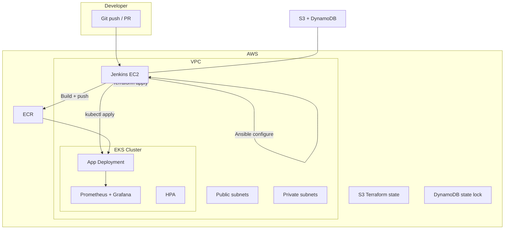
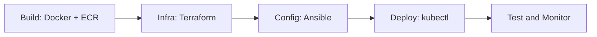
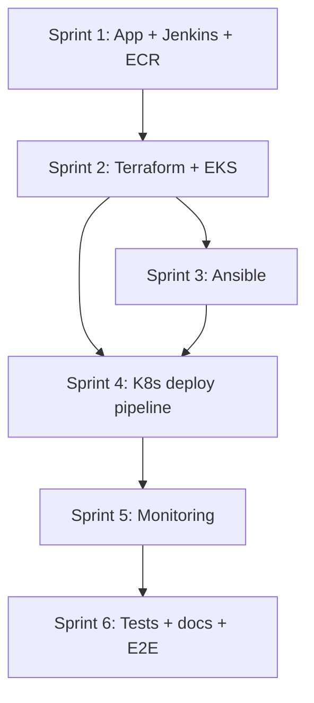

# End-to-End DevOps CI/CD Capstone — Full Project Plan

> Implementation roadmap for Project 4. Requirements source of truth: [task.md](task.md). Sprint checklists: [.cursor/skills/aws-devops-capstone/reference.md](../.cursor/skills/aws-devops-capstone/reference.md).

## Current state

The repository is **greenfield**: only requirements and scaffolding exist today.

| Present | Missing |
|---------|---------|
| [docs/task.md](task.md) — sprint requirements | `app/`, `terraform/`, `ansible/`, `jenkins/`, `kubernetes/`, `monitoring/` |
| [README.md](../README.md) — target layout | AWS resources, Jenkins server, EKS cluster |
| Cursor skill checklists in [reference.md](../.cursor/skills/aws-devops-capstone/reference.md) | Architecture diagram, runbooks, cost notes |

**Evaluation weights:** Implementation 75% · Documentation 15% · Cost optimization 10%.

**App note:** Integrate your existing app in Sprint 1 — adapt the Dockerfile, health endpoints, and tests to your app's language, repo/path, and health check endpoint. Until then, use `app/` as the integration point.

---

## Target architecture



---

## End-state Jenkins pipeline



Single **declarative Jenkinsfile** in `jenkins/Jenkinsfile` with optional separate jobs early in Sprint 1–2, converging to one pipeline by Sprint 6.

---

## Repository layout (canonical)

```
app/                  # Your existing web app (adapted)
terraform/            # VPC, EKS, EC2, S3 backend, IAM, security groups
ansible/              # Playbooks + inventory for EC2/EKS node prep
jenkins/              # Jenkinsfile(s), shared pipeline libraries if needed
kubernetes/           # Deployment, Service, HPA, probes, namespace
monitoring/           # Prometheus, Grafana, Alertmanager manifests
docs/                 # Architecture, sprint logs, runbooks, cost guide
```

Add to `.gitignore`: `*.tfstate*`, `.terraform/`, `terraform.tfvars`, kubeconfig secrets, Ansible vault files.

---

## Sprint-by-sprint plan

### Sprint 1 — Architecture, Docker, Jenkins foundation

**Goal:** Documented architecture, containerized app in ECR, Jenkins on EC2 with AWS/EKS access and Git-triggered builds.

1. **Architecture**
   - Create `docs/architecture.md` with diagram (VPC: public/private subnets, NAT, EKS control plane, worker nodes, Jenkins EC2, ECR, S3 state bucket).
   - Document IAM boundaries: Jenkins EC2 role (ECR push, EKS access, Terraform S3/DynamoDB, limited EC2/EKS API scope).

2. **Integrate your existing app**
   - Copy or submodule your app into `app/`.
   - Add/adapt **multi-stage Dockerfile** in `app/Dockerfile` (minimal runtime image).
   - Ensure **`/health` or equivalent** liveness/readiness endpoint for later K8s probes.
   - Local verify: `docker build -t app:local ./app && docker run -p 8080:8080 app:local`.

3. **AWS bootstrap (manual one-time or minimal Terraform)**
   - AWS region (recommend `ap-south-1` or your preferred region — pick one and stay consistent).
   - ECR repository: `devops-capstone-app`.
   - Jenkins EC2 (t3.small or t3.medium for cost), security group (8080/22 from your IP only), key pair.

4. **Jenkins setup**
   - Install plugins: Docker, Kubernetes, Pipeline, Git, AWS Credentials, Credentials Binding.
   - Configure AWS credentials via **IAM instance profile** (preferred) or scoped access keys in Jenkins Credentials (never commit).
   - Configure Git webhook or SCM poll to trigger a test job.
   - First job: build Docker image and push to ECR.

5. **Docs:** `docs/sprint-1.md` — Jenkins URL, ECR URI, access steps, diagram path.

**Definition of done:** Jenkins builds and pushes image to ECR; architecture doc complete; kubeconfig access to EKS attempted (full EKS may come in Sprint 2).

---

### Sprint 2 — Terraform infrastructure + Jenkins integration

**Goal:** Reproducible AWS infra via Terraform, applied from Jenkins, state in S3.

1. **Terraform modules** under `terraform/`:
   - **VPC module:** VPC, 2 AZs, public + private subnets, IGW, NAT (single NAT for cost).
   - **EKS module:** Cluster (1.29+), managed node group (start `t3.medium` × 2, min 1 / max 3 for cost).
   - **EC2 module:** Jenkins host (if not already created) or reference existing.
   - **Security groups:** Least-privilege (Jenkins → EKS API, nodes, ECR).
   - **IAM:** EKS cluster role, node group role, Jenkins policy attachments.

2. **Remote state**
   - `terraform/backend.tf`: S3 bucket + DynamoDB table for locking.
   - Bootstrap script or doc for one-time bucket/table creation.

3. **Jenkins Terraform stage**
   - Pipeline stage: `terraform init -backend-config=...`, `plan`, `apply -auto-approve` (with approval gate optional for demo safety).
   - Store `TF_VAR_*` in Jenkins credentials / parameterize environment.

4. **Cost tags** on all resources: `Project=devops-capstone`, `Environment=dev`, `ManagedBy=terraform`.

5. **Docs:** `docs/terraform.md` — variables, backend setup, destroy/rollback, estimated monthly cost.

**Definition of done:** Two consecutive Jenkins-driven `terraform apply` runs succeed without drift errors; `aws eks describe-cluster` returns healthy cluster.

---

### Sprint 3 — Ansible configuration management

**Goal:** Post-Terraform configuration of EC2/Jenkins and EKS worker prep via Ansible, chained in Jenkins.

1. **Ansible structure** under `ansible/`:
   - `site.yml` — main playbook.
   - `roles/common` — Docker, kubectl, AWS CLI, jq.
   - `roles/jenkins` — plugin sanity, docker group for jenkins user.
   - `inventory/` — static for Jenkins EC2; optional dynamic inventory from Terraform outputs.

2. **Terraform → Ansible handoff**
   - Export IPs/hostnames via Terraform outputs (`terraform output -json`).
   - Jenkins stage runs **after** Terraform: `ansible-playbook -i inventory site.yml`.

3. **Validation playbooks**
   - Assert `docker --version`, `kubectl version --client`, jenkins user in docker group.

4. **Docs:** `docs/ansible.md` — inventory, ad-hoc run, troubleshooting SSH.

**Definition of done:** Ansible runs automatically after infra stage; SSH verification confirms expected tooling versions.

---

### Sprint 4 — CI/CD deploy to EKS

**Goal:** Git push → build → test → ECR push → kubectl deploy with health checks and HPA.

1. **Kubernetes manifests** in `kubernetes/`:
   - `namespace.yaml`, `deployment.yaml`, `service.yaml` (LoadBalancer or Ingress — LoadBalancer is simpler for capstone demo).
   - **Liveness + readiness probes** targeting your app health endpoint.
   - **HPA:** CPU-based, min 2 / max 5 replicas (adjust to node capacity).

2. **Jenkinsfile stages** (declarative):
   - Checkout → Unit/smoke test → Docker build → ECR push (tag: `BUILD_NUMBER` + `git commit`).
   - Deploy: `aws eks update-kubeconfig` → `kubectl apply -f kubernetes/` → rollout status.
   - Post-deploy smoke: `curl` service endpoint.

3. **ECR image pull**
   - EKS node IAM role or `imagePullSecrets` if using private ECR (node role is standard on EKS).

4. **Docs:** `docs/pipeline.md` — stage diagram, rollback (`kubectl rollout undo`).

**Definition of done:** Sample commit triggers full path; app reachable via Service URL; probes and HPA visible in `kubectl get hpa`.

---

### Sprint 5 — Prometheus, Grafana, alerting

**Goal:** Observable cluster and app; alerts on critical failures; Jenkins failure notifications.

1. **Monitoring stack** in `monitoring/`:
   - Prometheus (Helm or raw manifests) with ServiceMonitor or pod annotations.
   - Grafana with datasource + dashboards (app RPS/latency, pod CPU/memory, node health).
   - Alertmanager or Prometheus alert rules: pod crash loop, high CPU, deployment unavailable.

2. **App metrics**
   - If your app supports Prometheus metrics, expose `/metrics`; otherwise rely on kube-state-metrics + cAdvisor node/pod metrics.

3. **Jenkins integration**
   - Post-build notifications on failure (email or Slack webhook via Jenkins credentials).
   - Optional: Prometheus alert when Jenkins deploy stage fails (via custom metric or external check).

4. **Docs:** `docs/monitoring.md` — Grafana URL/port-forward, alert runbook, dashboard screenshots.

**Definition of done:** Grafana shows live metrics; simulated pod failure triggers alert; Jenkins failure notification received.

---

### Sprint 6 — Testing, documentation, production readiness

**Goal:** Unattended end-to-end pipeline, complete docs, cost guide, viva-ready demo.

1. **Automated tests in pipeline**
   - App unit tests (framework depends on your app).
   - Post-deploy smoke/integration test stage.
   - Optional: `terraform validate`, `ansible-lint`, `kubeconform` on manifests.

2. **Trigger automation**
   - SCM webhook → full pipeline (or: infra job on schedule/tag, app deploy on main branch push — document chosen strategy).

3. **Documentation pack** in `docs/`:
   - `README.md` update with quickstart.
   - Architecture, Terraform, Ansible, Jenkins, Kubernetes, monitoring runbooks.
   - **Cost optimization section** (10% of grade): instance sizing, single NAT, HPA min replicas, `terraform destroy` cleanup checklist, estimated monthly spend.

4. **Viva/demo script** (`docs/demo-script.md`): 5–10 min walkthrough of all five pipeline stages with verification commands.

5. **Final E2E test:** Clean branch → full pipeline unattended → app + metrics + alerts verified.

**Definition of done:** All deliverables in [reference.md](../.cursor/skills/aws-devops-capstone/reference.md) checked with evidence.

---

## Security and cost principles (apply every sprint)

| Area | Approach |
|------|----------|
| Secrets | Jenkins Credentials + IAM roles; never commit `.env`, keys, or `terraform.tfvars` |
| Network | Private EKS nodes; restrict Jenkins SG; no `0.0.0.0/0` on SSH |
| IAM | Least privilege per service; EKS aws-auth / access entries for Jenkins role |
| Cost | Tag everything; t3.small/medium; single NAT; HPA min 1–2; document destroy procedure |
| State | S3 + DynamoDB locking; no local-only state for shared env |

**Rough dev cost estimate:** ~$150–250/month while running (EKS control plane ~$73, 2× t3.medium nodes, NAT, EC2 Jenkins). Emphasize teardown in docs for grading.

---

## Recommended execution order and dependencies



Sprint 1 can bootstrap Jenkins manually before Terraform owns EC2; refactor Jenkins into Terraform in Sprint 2 if needed.

---

## Immediate next steps (when implementation starts)

1. **Share your existing app details:** language/runtime, repo path or URL, port, health endpoint, test command.
2. **Confirm AWS prerequisites:** account access, preferred region, domain/DNS needs (optional).
3. **Implement Sprint 1** in order: architecture doc → app integration → ECR → Jenkins → first ECR push job.
4. **Iterate sprints 2–6** using checklists in [reference.md](../.cursor/skills/aws-devops-capstone/reference.md) as the gate for each sprint.

---

## Key files to create (summary)

| Sprint | Primary artifacts |
|--------|-------------------|
| 1 | `app/`, `app/Dockerfile`, `docs/architecture.md`, `docs/sprint-1.md` |
| 2 | `terraform/{main,variables,outputs,backend}.tf`, `terraform/modules/*`, `docs/terraform.md` |
| 3 | `ansible/site.yml`, `ansible/roles/*`, `ansible/inventory/*`, `docs/ansible.md` |
| 4 | `jenkins/Jenkinsfile`, `kubernetes/*.yaml`, `docs/pipeline.md` |
| 5 | `monitoring/*.yaml`, Grafana dashboards, `docs/monitoring.md` |
| 6 | Tests in app/ or `tests/`, `docs/demo-script.md`, cost section, updated README |
